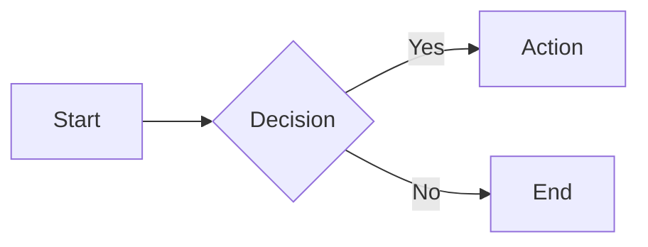

# Syntax quick reference

Elastic documentation uses a custom implementation of [MyST Markdown](https://mystmd.org/) with extended syntax for directives, metadata, and tagging.

This page offers quick guidance on commonly used syntax elements. Elements are in alphabetical order.

For the full syntax reference, go to [elastic.github.io/docs-builder/syntax/](https://elastic.github.io/docs-builder/syntax/).


:::{tip}
Contributing to [elastic.co/guide](https://www.elastic.co/guide/index.html)? Refer to [Contribute to `elastic.co/guide` (Asciidoc)](asciidoc-guide.md).
:::

## Admonitions

Use admonitions to caution users, or to provide helpful tips or extra information.

::::{dropdown} Types
:open:

These examples show the syntax first, followed by the rendered admonition.

 **Warning**

  ```markdown
      :::{warning}
      Users could permanently lose data or leak sensitive information.
      :::
  ```
  :::{warning}
  Users could permanently lose data or leak sensitive information.
  :::

  **Important**

  ```markdown
      :::{important}
      Less dire than a warning. Users might encounter issues with performance or stability.
      :::
  ```
  :::{important}
  Less dire than a warning. Users might encounter issues with performance or stability.
  :::

  **Note**
  ```markdown
      :::{note}
      Supplemental information that provides context or clarification.
      :::
  ```
  :::{note}
  Supplemental information that provides context or clarification.
  :::

  **Tip**
  ```markdown
      :::{tip}
      Advice that helps users work more efficiently or make better choices.
      :::
  ```
  :::{tip}
  Advice that helps users work more efficiently or make better choices.
  :::

  **Custom**
  ```markdown
      :::{admonition} Special note
      Custom admonition with custom label.
      :::
  ```
  :::{admonition} Special note
  Custom admonition with custom label.
  :::

::::

**DOs**<br>
✅ **Do:** Use custom admonitions as needed

**DON'Ts**<br>
❌ **Don't:** Stack admonitions<br>
❌ **Don't:** Overload a page with too many admonitions

For more details, refer to [Admonitions](https://elastic.github.io/docs-builder/syntax/admonitions).
<br>
<br>

---

## Anchors

A default anchor is automatically created for each [heading](#headings), in the form `#heading-text` (lowercase, with spaces converted to hyphens and special characters removed). To create a custom anchor, add it in square brackets at the end of a heading: `[my-better-anchor]`

:::{dropdown} Default anchor
:open:
```markdown
#### Hello world!
<!-- Auto-generated default anchor: #hello-world -->
```
:::


:::{dropdown} Custom anchor
:open:
```markdown
#### Hello world! [get-started]
```
:::

**DOs**<br>
✅ **Do:** Create custom anchors for repeated structural headings like "Example request"<br>

**DON'Ts**<br>
❌ **Don't:** Include punctuation marks in custom anchors<br>
❌ **Don't:** Define custom anchors in text that is not a heading

For more details, refer to [Links](https://elastic.github.io/docs-builder/syntax/links#same-page-links-anchors).
<br>
<br>

---

## Applies to

Use `applies_to` metadata to tag content for specific contexts, for example whether a feature is available on certain products, versions, or deployment types.

This metadata enables you to write [cumulative documentation](how-to/cumulative-docs/index.md), because Elastic no longer publishes separate docs sets for every minor release.

**Example: Section tag**

:::{dropdown} Syntax
:open:
````markdown
# Stack-only content
```{applies_to}
stack:
```
````
:::

:::{dropdown} Output
:open:
#### Stack-only content
```{applies_to}
stack:
```
:::

For full syntax and more examples, refer to [the `applies_to` documentation](https://elastic.github.io/docs-builder/syntax/applies).

:::{tip}
The syntax for `applies_to` metadata differs depending on whether it's added at the [page level](https://elastic.github.io/docs-builder/syntax/applies/#page-level) (in frontmatter), [section level](https://elastic.github.io/docs-builder/syntax/applies/#section-level) (after a heading), or [inline](https://elastic.github.io/docs-builder/syntax/applies/#inline-level).
:::


:::{tip}
The `applies_to` tags are scope signals for readers, not comprehensive metadata. If a page contains general information that applies to all contexts, it doesn't need tags.
:::

**DOs**<br>
✅ **Do:** Define a set of [page-level tags](https://elastic.github.io/docs-builder/syntax/applies#page-level) in a front matter block<br>
✅ **Do:** Add section-level tags in an `{applies_to}` [directive](https://elastic.github.io/docs-builder/syntax/applies#section-level) after a heading<br>
✅ **Do:** Indicate versions (`major.minor`) and release phases like `beta`<br>
✅ **Do:** Describe critical patch-level differences in prose rather than using version tags

**DON'Ts**<br>
❌ **Don't:** Add `applies_to` tags to general, broadly applicable content<br>
❌ **Don't:** Overload pages with repetitive tags
<br>
<br>

---

## Applies switch

The `applies-switch` directive creates tabbed content where each tab displays an `applies_to` badge instead of a text title. Use this to show content that varies by deployment type or version. All applies switches on a page automatically sync together.

:::::{dropdown} Syntax
:open:
```markdown
::::{applies-switch}

:::{applies-item} stack: ga 9.0+
Content for Stack
:::

:::{applies-item} serverless: ga
Content for Serverless
:::

::::
```
:::::

:::::{dropdown} Output
:open:
::::{applies-switch}

:::{applies-item} stack: ga 9.0+
Content for Stack
:::

:::{applies-item} serverless: ga
Content for Serverless
:::

::::
:::::

**DOs**<br>
✅ **Do:** Use when content varies significantly by deployment type or version<br>
✅ **Do:** Combine multiple `applies_to` definitions using YAML object notation: `{ ece: ga 4.0+, ess: ga }`

For more details, refer to [Applies switch](https://elastic.github.io/docs-builder/syntax/applies-switch).
<br>
<br>

---

## Code blocks

Multi-line blocks for code, commands, configuration, and similar content. Use three backticks ` ``` ` on separate lines to start and end the block. For syntax highlighting, add a language identifier after the opening backticks.

:::{dropdown} Syntax
:open:
```markdown
    ```yaml
    server.host: "0.0.0.0"
    elasticsearch.hosts: ["http://localhost:9200"]
    ```
```
:::

:::{dropdown} Output
:open:
```yaml
server.host: "0.0.0.0"
elasticsearch.hosts: ["http://localhost:9200"]
```
:::


**DOs**<br>
✅ **Do:** Include code blocks within lists or other block elements as needed<br>
✅ **Do:** Add language identifiers like `yaml`, `json`, `bash`

**DON'Ts**<br>
❌ **Don't:** Place code blocks in admonitions<br>
❌ **Don't:** Use inline code formatting (single backticks) for multi-line content

For more details, refer to [Code](https://elastic.github.io/docs-builder/syntax/code).
<br>
<br>

---

## Code callouts

Inline annotations that highlight or explain specific lines in a code block.

### Explicit callout
To explicitly create a code callout, add a number marker in angle brackets (`<1>`, `<2>`, and so on) at the end of a line. Add the corresponding callout text below the code block, in a numbered list that matches the markers.

:::{dropdown} Syntax
:open:

  ````markdown callouts=false
      ```json
      {
        "match": {
          "message": "search text" <1>
        }
      }
      ```
      1. Searches the `message` field for the phrase "search text"
  ````
:::

:::{dropdown} Output
:open:

```json
{
  "match": {
    "message": "search text" <1>
  }
}
```
1. Searches the `message` field for the phrase "search text"<br>
:::

### Automatic (comment-based) callout [magic-callout]
Add comments with `//` or `#` to automatically create callouts.

:::{dropdown} Syntax
:open:
  ````markdown callouts=false
    ```json
    {
      "match": {
        "message": "search text" // Searches the message field
      }
    }
    ```
  ````
:::

:::{dropdown} Output
:open:

```json
{
  "match": {
    "message": "search text" // Searches the message field
  }
}
```
:::

**DOs**<br>
✅ **Do:** Keep callout text short and specific<br>
✅ **Do:** Use only one type of callout per code block (don't mix [explicit](#explicit-callout) and [automatic](#magic-callout))<br>
✅ **Do:** Make sure there's a corresponding list item for each explicit callout marker in a code block

**DON'Ts**<br>
❌ **Don't:** Overuse callouts — they can impede readability

For more details, refer to [Code callouts](https://elastic.github.io/docs-builder/syntax/code#code-callouts).
<br>
<br>

---

## Comments

Use `%` to add single-line comments. Use HTML-style `<!--` and `-->` for multi-line comments.

:::{dropdown} Syntax
:open:
```markdown
    % This is a comment
    This is regular text

    <!--
    so much depends
    upon
    a multi-line
    comment
    -->
    Regular text after multi-line comment
```
:::

:::{dropdown} Output
:open:
% This is a comment
This is regular text

<!--
so much depends
upon
a multi-line
comment
-->
Regular text after multi-line comment

:::

**DOs**<br>
✅ **Do:** Add a space after the `%` in single-line comments

**DON'Ts**<br>
❌ **Don't:** Use `#` or `//` for comments (reserved for [magic callouts](#magic-callout))
<br>
<br>

---

## Dropdowns

Collapsible blocks for hiding and showing content.

::::{dropdown} Syntax
:open:
```markdown
    :::{dropdown} Title or label
    Collapsible content
    :::
```
::::

::::{dropdown} Output
:open:
:::{dropdown} Title or label
Collapsible content
:::
::::

**DOs**<br>
✅ **Do:** Use dropdowns for text, lists, images, code blocks, and tables<br>
✅ **Do:** Add `:open:` to auto-expand a dropdown by default

**DON'Ts**<br>
❌ **Don't:** Use dropdowns for very long paragraphs or entire sections

For more details, refer to [Dropdowns](https://elastic.github.io/docs-builder/syntax/dropdowns).
<br>
<br>

---

## Footnotes

Add notes and references without cluttering the main text. Footnotes are automatically numbered and linked. References appear as superscript numbers in the text, and the footnote content renders at the bottom of the page.

:::{dropdown} Syntax
:open:
```markdown
Here's a simple footnote[^fn-1] and a named one[^fn-note].

[^fn-1]: This is the first footnote.
[^fn-note]: This footnote uses a named identifier.
```
:::

:::{dropdown} Output
:open:
Here's a simple footnote[^fn-1] and a named one[^fn-note].
:::

[^fn-1]: This is the first footnote.
[^fn-note]: This footnote uses a named identifier.

**DOs**<br>
✅ **Do:** Use descriptive identifiers like `[^api-note]` for maintainability<br>
✅ **Do:** Keep footnotes focused on a single piece of information<br>
✅ **Do:** Place footnote definitions at the document level, not inside directives

**DON'Ts**<br>
❌ **Don't:** Use footnotes for content important enough to be in the main text<br>
❌ **Don't:** Write very long footnotes — consider using the main text instead<br>
❌ **Don't:** Define footnotes inside tab-sets, admonitions, or other containers

For more details, refer to [Footnotes](https://elastic.github.io/docs-builder/syntax/footnotes).
<br>
<br>

---

## Headings
Headings mark the title of a page or section. To create a heading, add number signs `#` at the beginning of the line (one `#` for each heading level).

:::{dropdown} Syntax
:open:
```markdown
# Heading 1
## Heading 2
### Heading 3
#### Heading 4
```
:::

::::{dropdown} Output
:open:
:::{image} images/headings.png
:screenshot:
:alt: Heading levels
:width: 300px
:::

::::

**DOs**<br>
✅ **Do:** Start every page with a Heading 1<br>
✅ **Do:** Use only one Heading 1 per page<br>
✅ **Do:** Define custom anchors for repeated headings

**DON'Ts**<br>
❌ **Don't:** Use headings in tabs or dropdowns<br>
❌ **Don't:** Go deeper than Heading 4

For more details, refer to [Headings](https://elastic.github.io/docs-builder/syntax/headings).
<br>
<br>

---

## Images
Standard Markdown image syntax: `![alt text]` in square brackets, followed by the image path in parentheses.

:::{dropdown} Syntax
:open:
```markdown

```
:::

:::{dropdown} Output
:open:

:::

**DOs**<br>
✅ **Do:** Store images in a centralized directory<br>
✅ **Do:** Follow v3 [best practices for screenshots](how-to/cumulative-docs/badge-placement.md#images)<br>
✅ **Do:** Specify `:screenshot:` in an [image directive](https://elastic.github.io/docs-builder/syntax/images#screenshots) to add a border

**DON'Ts**<br>
❌ **Don't:** Use lots of UI screenshots that create a maintenance burden<br>
❌ **Don't:** Include confidential info or PII in an image<br>
❌ **Don't:** Add a drop shadow or torn edge effect

For more details, refer to [Images](https://elastic.github.io/docs-builder/syntax/images).
<br>
<br>

---

## Icons

Include icons inline using the `` {icon}`icon-name` `` syntax.

:::{dropdown} Syntax
:open:
```markdown
Click the {icon}`gear` **Settings** icon.
Status: {icon}`checkCircle` Success | {icon}`warning` Warning | {icon}`error` Error
```
:::

:::{dropdown} Output
:open:
Click the {icon}`gear` **Settings** icon.

Status: {icon}`checkCircle` Success | {icon}`warning` Warning | {icon}`error` Error
:::

**DOs**<br>
✅ **Do:** Use icons in headings, lists, tables, and paragraphs<br>
✅ **Do:** Pair icons with descriptive text for accessibility<br>

**DON'Ts**<br>
❌ **Don't:** Use icons without context or explanation<br>
❌ **Don't:** Overuse icons — they should enhance, not clutter

For more details and the full icon list, refer to [Icons](https://elastic.github.io/docs-builder/syntax/icons).
<br>
<br>

---

## Inline formatting
Elastic Docs v3 supports standard Markdown inline formatting.

| Markdown | Output |
| -------- | ------ |
| \*\*strong\*\* | **strong** |
| \_emphasis\_ | _emphasis_ |
| \`monospace\` | `monospace` |
| \~\~strikethrough\~\~ | ~~strikethrough~~ |
| `\*escaped symbols\*` | \*escaped symbols\* |

**DOs**<br>
✅ **Do:** Use `_emphasis_` to introduce a term<br>
✅ **Do:** Use `monospace` in headings and other elements as needed

**DON'Ts**<br>
❌ **Don't:** Overuse `**strong**` or `_emphasis_` — aim for readability
<br>
<br>

---

## Keyboard markup

Represent keyboard keys and shortcuts using the `` {kbd}`key-name` `` syntax. Combine keys with `+` and show alternatives with `|`.

:::{dropdown} Syntax
:open:
```markdown
Press {kbd}`enter` to submit.
Use {kbd}`cmd+shift+p` to open the command palette.
Use {kbd}`ctrl|cmd+c` to copy text.
```
:::

:::{dropdown} Output
:open:
Press {kbd}`enter` to submit.

Use {kbd}`cmd+shift+p` to open the command palette.

Use {kbd}`ctrl|cmd+c` to copy text.
:::

**DOs**<br>
✅ **Do:** Use keyword equivalents `plus` and `pipe` to render those literal keys<br>

**DON'Ts**<br>
❌ **Don't:** Use raw `+` or `|` characters when you mean to display them as keys

For more details and available key names, refer to [Keyboard markup](https://elastic.github.io/docs-builder/syntax/keyboard).
<br>
<br>

---

## Links

Standard Markdown links to doc pages, sections (anchors), or external content. Prefer absolute paths for links within the doc set.

:::{dropdown} Syntax
:open:
```markdown
    [link text](/absolute/file.md#anchor)
    [link text](https://external-site.com)
    [link text](other-repo://path/file.md)
    (#same-page-anchor)
```
:::

**DOs**<br>
✅ **Do:** Use inline formatting in link text: `[**bold link**](https://elastic.github.io/docs-builder/syntax/bold-page)`<br>
✅ **Do:** Autogenerate link text from the page or section title: `[](https://elastic.github.io/docs-builder/syntax/use-title#section)`<br>
✅ **Do:** Define a custom [anchor](#anchors) by adding `[anchor-text]` at the end of a heading line

**DON'Ts**<br>
❌ **Don't:** Use unclear, inaccessible link text like "click here" or "this"<br>
❌ **Don't:** Include terminal punctuation in link text

For more details, refer to [Links](https://elastic.github.io/docs-builder/syntax/links).
<br>
<br>

---

## Lists

Standard Markdown ordered (numbered) and unordered (bulleted) lists. Indent with four spaces to nest paragraphs and other elements under a list item. Unordered lists can start with hyphens `-`, asterisks `*`, or plus signs `+`.

:::{dropdown} Syntax
:open:

  ```
      - Unordered item 1
      ····Paragraph within item 1
      - Unordered item 2
  ```

  ```
  1. Ordered item 1
  2. Ordered item 2
  ```
:::

**DOs** <br>
✅ **Do:** Add code blocks, images, admonitions, and other content within a list item<br>
✅ **Do:** Nest lists, mixing ordered and unordered as needed<br>
✅ **Do:** Use parallel structure and phrasing in list items<br>
✅ **Do:** Capitalize only the first word of list items (sentence case)<br>
✅ **Do:** Use terminal punctuation consistently and only for complete sentences

**DON'Ts** <br>
❌ **Don't:** Use lists solely for layout purposes <br>
❌ **Don't:** Use lists for structured data or comparisons — use tables instead

For more details, refer to [Lists](https://elastic.github.io/docs-builder/syntax/lists).
<br>
<br>

---

## Math

Render mathematical expressions using LaTeX syntax with the `{math}` directive. Expressions are rendered client-side using KaTeX.

::::{dropdown} Syntax
:open:
```markdown
:::{math}
E = mc^2
:::
```
::::

::::{dropdown} Output
:open:
:::{math}
E = mc^2
:::
::::

**DOs**<br>
✅ **Do:** Use LaTeX display delimiters (`\[` `\]`) or environments (`\begin{align}`) for complex expressions<br>
✅ **Do:** Add labels with `:label:` for cross-referencing

For more details, refer to [Math](https://elastic.github.io/docs-builder/syntax/math).
<br>
<br>

---

## Mermaid diagrams

Create diagrams using [Mermaid](https://mermaid.js.org/) with standard fenced code blocks. Diagrams are rendered client-side in the browser.

::::{dropdown} Syntax
:open:
````markdown

````
::::

::::{dropdown} Output
:open:

::::

**DOs**<br>
✅ **Do:** Use different types of diagrams, such as flowcharts, sequence diagrams, state diagrams, and so on<br>
✅ **Do:** Keep diagrams focused on a single concept<br>
✅ **Do:** Summarize complex diagrams in accompanying text

**DON'Ts**<br>
❌ **Don't:** Use diagrams as the only way to convey important information<br>
❌ **Don't:** Create overly complex diagrams with too many elements


For more details, refer to [Mermaid diagrams](https://elastic.github.io/docs-builder/syntax/mermaid).
<br>
<br>

---

## Navigation title

Optional [front matter](https://elastic.github.io/docs-builder/syntax/frontmatter) element that sets a custom title for navigation items. Appears in the left navigation (table of contents), breadcrumbs, and previous/next links. For information about page titles, refer to [Headings](#headings).

:::{dropdown} Syntax
:open:

Page front matter (YAML):

```yaml
---
navigation_title: "Minimalist identifier"
---
```

Page title (Markdown H1):

```markdown
# Full descriptive page title with product context
```

:::

:::{dropdown} Output
:open:


:::


**DOs**<br>
✅ **Do:** Use active phrasing and shorter forms<br>
✅ **Do:** Make sure the navigation title clearly identifies the page topic<br>
✅ **Do:** Omit product names that appear in the full H1 page title

**DON'Ts**<br>
❌ **Don't:** Duplicate the H1 page title<br>
❌ **Don't:** Use a long navigation title or lots of punctuation<br>
❌ **Don't:** Abbreviate with periods or ellipses

For more details, refer to [Title](https://elastic.github.io/docs-builder/syntax/titles).
<br>
<br>

---

## Substitutions
Key-value pairs that define reusable variables. They help ensure consistency and enable short forms. To use a substitution (or "sub"), surround the key with double curly brackets: `{{variable}}`

### Define a sub

:::{dropdown} Syntax
:open:

In `docset.yml`:

```
subs:
  ccs: "cross-cluster search"
  ech: "Elastic Cloud Hosted"
  kib: "Kibana"
```
:::


### Use a sub

This example uses the sub defined in `docset.yml` above.

:::{dropdown} Syntax
:open:

In `myfile.md`:

```
{{ech}} supports most standard {{kib}} settings.
```
:::

:::{dropdown} Output
:open:

{{ech}} supports most standard {{kib}} settings.
:::

**DOs** <br>
✅ **Do:** Check the global `docset.yml` file for existing product and feature name subs<br>
✅ **Do:** Use substitutions in code blocks by setting `subs=true`  <br>
✅ **Do:** Define new page-specific substitutions as needed

**DON'Ts**<br>
❌ **Don't:** Override a `docset.yml` sub by defining a page-level sub with the same key (causes build errors)<br>
❌ **Don't:** Use substitutions for common words that don't need to be standardized

For more details, refer to [Substitutions](https://elastic.github.io/docs-builder/syntax/substitutions).
<br>
<br>

---

## Stepper

Steppers provide a visual representation of sequential steps for tutorials or guides. Use steppers instead of numbered section headings when documenting complex procedures. Step titles automatically appear in the page's table of contents.

::::::{dropdown} Syntax
:open:
```markdown
:::::{stepper}

::::{step} Install
First install the dependencies.
::::

::::{step} Build
Then build the project.
::::

::::{step} Done
::::

:::::
```
::::::

::::::{dropdown} Output
:open:
:::::{stepper}

::::{step} Install
First install the dependencies.
::::

::::{step} Build
Then build the project.
::::

::::{step} Done
::::

:::::
::::::

**DOs**<br>
✅ **Do:** Use steppers for multi-step tutorials or complex procedures<br>
✅ **Do:** Add `:anchor:` to override the default anchor for a step

**DON'Ts**<br>
❌ **Don't:** Nest steppers inside tabs, dropdowns, or other containers if you want step titles in the ToC

For more details, refer to [Stepper](https://elastic.github.io/docs-builder/syntax/stepper).
<br>
<br>

---

## Tabs

Block element that displays content in switchable tabs to help users find the right context (such as deployment type or programming language). [Synced tab groups](https://elastic.github.io/docs-builder/syntax/tabs#tab-groups) are supported.

:::::{dropdown} Syntax
:open:
```markdown
    ::::{tab-set}

    :::{tab-item} Tab 1 title
    Tab 1 content
    :::

    :::{tab-item} Tab 2 title
    Tab 2 content
    :::

    ::::
```
:::::

:::::{dropdown} Output
:open:
::::{tab-set}

:::{tab-item} Tab 1 title
Tab 1 content
:::

:::{tab-item} Tab 2 title
Tab 2 content
:::

::::
:::::

**DOs**<br>
✅ **Do:** Use clear, descriptive tab labels<br>
✅ **Do:** Make sure all tabs have the same type of content and similar goals<br>
✅ **Do:** Keep tab content scannable and self-contained (don't make users switch tabs to follow steps or compare content)<br>
✅ **Do:** Include other block elements in tabs, like [admonitions](#admonitions)

**DON'Ts**<br>
❌ **Don't:** Nest tabs<br>
❌ **Don't:** Split step-by-step procedures across tabs<br>
❌ **Don't:** Use more than 6 tabs (use as few as possible)<br>
❌ **Don't:** Use tabs in [dropdowns](#dropdowns)


For more details, refer to [Tabs](https://elastic.github.io/docs-builder/syntax/tabs).
<br>
<br>

---

## Tables

Standard table layout for structured data. Automatically scrolls horizontally if needed. The **header** row is optional.

:::{dropdown} Syntax
:open:
```markdown
    | Header | Header |
    | ------ | ------ |
    | Data   | Info   |
    | Info	 | Data   |
```
:::

:::{dropdown} Output
:open:
| Header | Header |
| ------ | ------ |
| Data   | Info   |
| Info	 | Data   |
:::

**DOs**<br>
✅ **Do:** Use leading and trailing pipes for clarity<br>
✅ **Do:** Add spaces for readability (they're trimmed)<br>
✅ **Do:** Keep cell content scannable and parallel<br>
✅ **Do:** Use standard Markdown text alignment when necessary (`:-- --: :--:`)

**DON'Ts**<br>
❌ **Don't:** Insert block elements or multiple paragraphs in a table cell<br>
❌ **Don't:** Use a table solely for position or spacing purposes

For more details, refer to [Tables](https://elastic.github.io/docs-builder/syntax/tables).