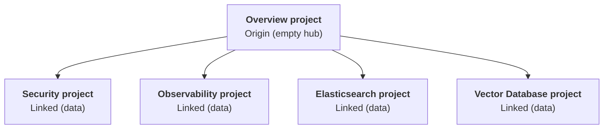

---
applies_to:
  stack: unavailable
  serverless: ga
products:
  - id: cloud-serverless
navigation_title: "Cross-project search"
---

# Configure {{cps}} [configure-cross-project-search]

::::{include} /deploy-manage/_snippets/cps-definition.md
::::

{{cps-cap}} provides {{serverless-short}} with cross-project search capabilities similar to [{{ccs}}](/explore-analyze/cross-cluster-search.md), with a few differences and enhancements. For a side-by-side syntax comparison, refer to .

* Setting up {{cps}} doesn't require an understanding of your deployment architecture or complex security configurations.
* Permissions stay consistent across projects, and you can always adjust scope and access as needed.
* Searches are performed across projects by default, reducing the need to refactor your queries as you link additional projects.

This section explains how to set up and manage {{cps}} for your organization, including linking projects, managing user access, and refining scope. For information on using {{cps}}, including syntax and examples, refer to .

:::{note}
{{cps-cap}} is available for {{serverless-full}} projects only. For other deployment types, refer to [{{ccs}}](/explore-analyze/cross-cluster-search.md).
:::

## Key concepts

::::{include} /deploy-manage/_snippets/cps-origin-linked-definitions.md
::::

### Projects and search scope

::::{include} /explore-analyze/cross-project-search/_snippets/cps-default-search-behavior.md
::::

Administrators can also adjust the search scope by [configuring the {{cps-init}} scope for each space](/deploy-manage/cross-project-search-config/cps-config-access-and-scope.md#cps-default-search-scope). For best results, set this space-level default before you link projects.

For details about project IDs and aliases used in search expressions, refer to [Project IDs and aliases](/explore-analyze/cross-project-search.md#project-ids-and-aliases).

## Before you begin [cps-prerequisites]

Before you configure {{cps}}, review these prerequisites and best practices:

- You must be an organization owner or project administrator:
  - **Organization owners** can link any projects within the organization.
  - **Project administrators** must have admin access on both the origin project and each linked project.
- Your origin and linked projects must meet certain [requirements](#cps-compatibility).
- Consider the [architecture patterns](#cps-arch) and choose the right linking topology for your organization.

### Projects available for linking [cps-compatibility]

To be available for linking, projects must meet the following requirements:

- The origin project and all linked projects must be in the same {{ecloud}} organization.
- You can link any combination of {{product.elasticsearch}}, {{es}} {{vectordb}}, {{product.observability}}, and {{product.security}} projects in the same organization.
- Projects can be linked across cloud providers and regions. For example, a project in GCP `us-east4` can be linked to a project in AWS `eu-central-1` without any additional configuration.
- {{sec-serverless}} and {{obs-serverless}} projects require the **Complete** feature tier. Projects on the **Essentials** tier are not compatible with {{cps}}.

Only compatible projects appear in the [{{cps}} linking wizard](/deploy-manage/cross-project-search-config/cps-config-link-and-manage.md#cps-link-projects). If a project you expected to link to is missing from the list, it might not meet the requirements, or you might not have the necessary [permissions](#cps-compatibility) on the project.

## Plan your {{cps-init}} architecture [cps-arch]

When configuring {{cps}}, consider how the {{cps-init}} architecture (or linking pattern) will affect searches, dashboards, and alerting across your organization. {{cps-cap}} supports three patterns, each with a different level of operational risk.

### Recommended: Overview project [cps-arch-overview]

For most deployments, we recommend creating a dedicated **overview project** that can act as an origin project. You can also think of this as a hub-and-spoke model.

In this architecture, you create a new, empty project and link existing projects to it. You run all cross-project searches from the new overview project, while your actual active projects continue to operate independently. The linked ("spoke") projects are not linked to each other.

Searches run from the overview project across all linked projects. Linked projects operate independently and are not linked to each other. You can link any combination of compatible projects.

The overview project becomes a central point for broad searches, dashboards, and investigations, without affecting your existing setup.

### Other supported patterns

The overview project model is strongly recommended and appropriate for most {{cps-init}} configurations. These additional patterns are valid, but they involve additional risk and require careful configuration:

- **Shared data project (N-to-1):** A single project stores data from a shared service (for example, logs). Multiple origin projects link to this central data project.

    The N-to-1 pattern is often used when several teams need to query shared data independently. The main risk is that linking to a shared data project affects searches, dashboards, and alerts in each origin project. If the shared project is a large, active project, the expanded dataset might cause unexpected behavior. If you're using this pattern, make sure to [manage user access](/deploy-manage/cross-project-search-config/cps-config-access-and-scope.md#manage-user-and-api-key-access) and consider [CPS scope](/deploy-manage/cross-project-search-config/cps-config-access-and-scope.md#cps-search-scope).

- **Data mesh (N-to-N):** Multiple active projects link directly to each other.

    The N-to-N pattern is the most complex and involves the highest risk. After you link projects, all searches, dashboards, and alerting rules in each origin project will query data from every linked project by default, which might make workflows unpredictable. Make sure you check alerting rules, which might be applied to data that the rule was never intended to evaluate.

## Configure {{cps-init}}

After reviewing the architecture patterns, you can configure {{cps-init}} scope and manage linked projects. For best results, complete these tasks in order:

1. [Set space scope defaults](/deploy-manage/cross-project-search-config/cps-config-access-and-scope.md#about-cps-init-scope): Configure the default {{cps}} scope for each space that will be used with {{cps}}.
1. [Manage user access and programmatic access](/deploy-manage/cross-project-search-config/cps-config-access-and-scope.md): Confirm user roles in both the origin and linked projects, as well as roles granted to [{{ecloud}} API keys](/deploy-manage/api-keys/elastic-cloud-api-keys.md#roles) that will be used with {{cps}}.
1. [Link and manage projects](/deploy-manage/cross-project-search-config/cps-config-link-and-manage.md): Link projects in the {{ecloud}} UI, manage linked projects, and unlink projects.

Make sure to also review the [search performance impacts](#cps-search-performance), [feature impacts](#cps-feature-impacts), and [limitations](#cps-limitations) of {{cps-init}}.

## Billing [cps-billing]

::::{include} /deploy-manage/_snippets/cps-billing.md
::::

## Search performance impacts [cps-search-performance]

When you search across linked projects, each query coordinates across multiple projects before returning results. This adds a small amount of latency compared to searching a single project. The overhead is generally measured in milliseconds and depends on factors like response size and query complexity.

Queries that cross region or cloud provider boundaries have higher latency due to network distance.

## Feature impacts [cps-feature-impacts]

When you link projects for {{cps}}, the expanded dataset can affect existing features in the origin project. By default, searches, alerts, dashboards, and other features in the origin project run against the combined dataset of the origin and all linked projects. Features tuned for a single project's data might behave differently with a larger dataset.

{{cps-cap}} results are filtered by each user's role assignments across projects. Users with different roles see different results from the same query. Review [user access](/deploy-manage/cross-project-search-config/cps-config-access-and-scope.md#manage-user-and-api-key-access) on each linked project to make sure that users have the appropriate permissions to access the data they need. 

How you work with the expanded dataset depends on how you search:

- **{{kib}} apps:** Scope controls vary by app. [Set the default {{cps}} scope for each space](/deploy-manage/cross-project-search-config/cps-config-access-and-scope.md#cps-default-search-scope) before you link projects. For details on how individual apps handle {{cps-init}} scope, including which apps support the scope selector and query-level overrides, refer to [{{cps-cap}} availability by app](/explore-analyze/cross-project-search/cross-project-search-manage-scope.md#cps-availability).
- **Query syntax:** [Because queries now run across all linked projects by default](/explore-analyze/cross-project-search.md#cps-cap-as-the-default-behavior-for-linked-projects), queries that were written for a single project might return a larger result set. To restrict scope, use [qualified expressions](/explore-analyze/cross-project-search/cross-project-search-search.md#search-expressions) or [project routing](/explore-analyze/cross-project-search/cross-project-search-project-routing.md).

:::{warning}
By default, rules in the origin project run against the combined dataset of the origin and all linked projects. Rules tuned for a single project's data might produce false positives when they evaluate a larger dataset. This is one reason we recommend using a dedicated [overview project](/deploy-manage/cross-project-search-config.md#cps-arch-overview), so that existing rules on data projects are not affected. Make sure to also consider the [default cross-project search scope for each space](/deploy-manage/cross-project-search-config/cps-config-access-and-scope.md#cps-default-search-scope), or save explicit project routing on individual rules.
:::

## Limitations [cps-limitations]

{{cps-cap}} has the following limitations:

::::{include} /deploy-manage/_snippets/cps-limitations-core.md
::::
* Additional limitations apply to Elastic {{observability}} and {{elastic-sec}} projects.

### {{elastic-sec}} apps

The following limitations apply to {{elastic-sec}} apps. For how each app uses {{cps-init}}, including the scope selector and query-level overrides, refer to [{{cps-cap}} support in {{elastic-sec}} apps](/explore-analyze/cross-project-search/cross-project-search-manage-scope.md#cps-availability-security).

- **Alert, event, and attack flyouts:** Session View isn't available for documents from linked projects. Some actions are hidden or disabled.
- **Alerts:** The Alerts page doesn't show alerts that a linked project generated independently. Only alerts created by origin project rules appear.
- **Attack Discovery:** Discoveries are based on origin project alerts only. Alerts from linked projects aren't included.
- **Cases:** You can't attach an alert or event from a linked project to a case.
- **{{elastic-defend}} and Osquery:** Policies, artifacts, response actions, and Osquery saved queries and packs can't be shared or managed across linked projects.
- **Entity store:** A host that appears in more than one project isn't combined into a single entity at the origin. Risk scoring runs on the origin project only.
- **{{ml-cap}} rules:** {{ml-cap}} rules don't use the space-level {{cps}} scope. They use the scope of the underlying {{anomaly-detect}} job's {{dfeed}}, which might differ from the space default.
- **SIEM Readiness and Value report:** These features don't include data from linked projects.
- **Timeline:** Some actions are disabled for documents from linked projects.

### Elastic {{observability}} apps

{{observability}} apps have partial {{cps-init}} support. For example:

* APM, Infrastructure, and Synthetics use session scope.
* SLOs use stored scope.
* Streams remain scoped to the origin project.
* Alerts are from the origin project only, even when rules query linked-project data.

For specific app details, refer to [{{cps-cap}} in {{observability}}](/solutions/observability/cross-project-search.md).

## Using {{cps-init}}

After you configure {{cps}} and link projects, users can start searching across linked projects from the origin project. For search syntax, scope controls, and examples, refer to the following pages:

- [{{cps-cap}} overview](/explore-analyze/cross-project-search.md): Learn how to build queries in a {{cps-init}} context, including how to restrict search scope.
- : Learn how {{cps-init}} works with compatible {{kib}} apps, including how to adjust search scope.
- : Compare {{cps-init}} and {{ccs}} query syntax, behavior, and scope control side by side.
