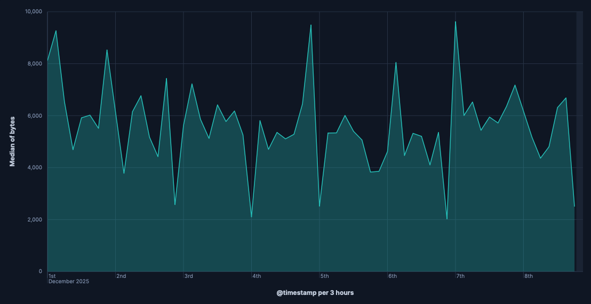
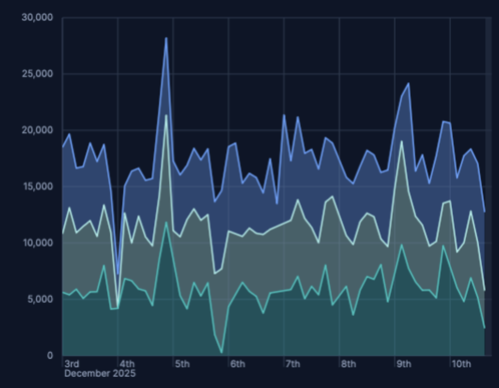
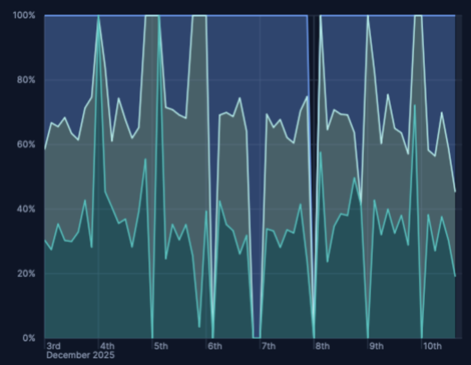
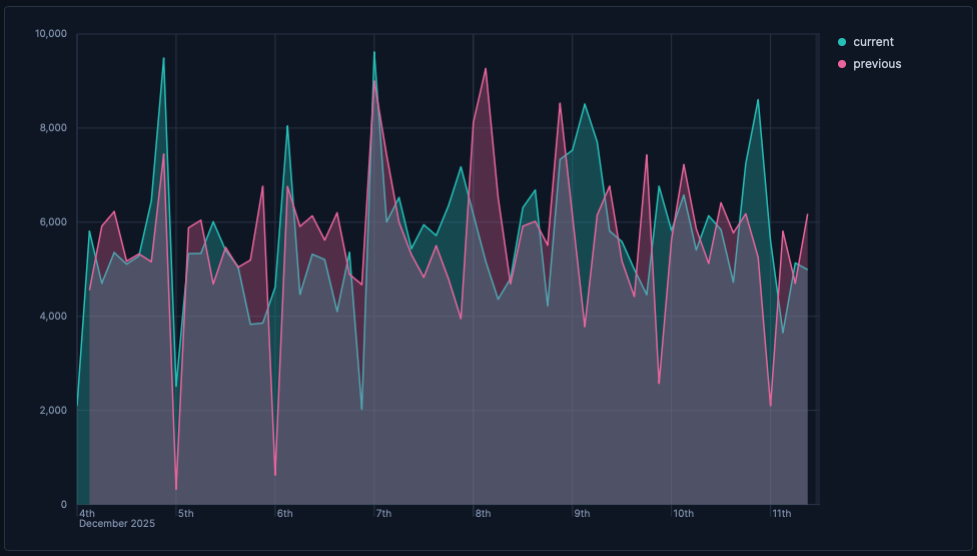
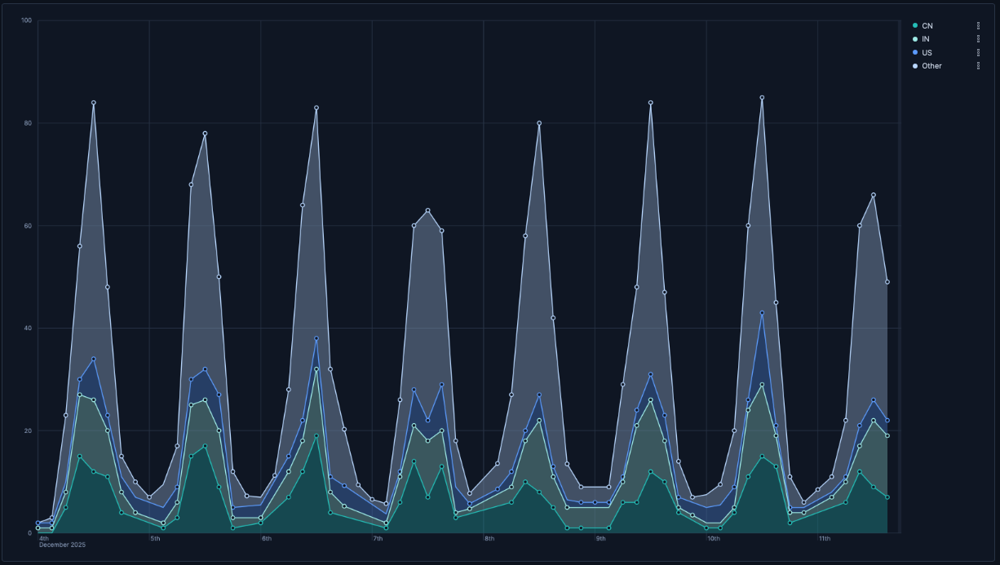
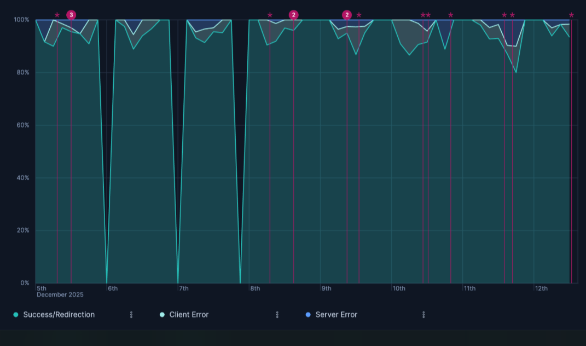

# Build area charts with {{kib}}

Area charts are line charts with the area below the line filled in with a certain color or texture. Area charts work with numeric metrics over the horizontal axis (typically time) and are ideal to display quantitative values over an interval or time period, to show trends for time series like traffic, CPU, revenue, or error rates.

You can create area charts in {{kib}} using [**Lens**](../lens.md).

## Build an area chart

To build an area chart:

::::::{stepper}

:::::{step} Access Lens
**Lens** is {{kib}}'s main visualization editor. You can access it:
- From a dashboard: On the **Dashboards** page, open or create the dashboard where you want to add an area chart, then add a new visualization.
- From the **Visualize library** page by creating a new visualization.
:::::

:::::{step} Set the visualization to Area
New visualizations often start as **Bar** charts.

Using the **Visualization type** dropdown, select **Area**.
:::::

:::::{step} Define the data to show
1. Select the {{data-source}} that contains your data.
2. Drag a [time field](elasticsearch://reference/elasticsearch/mapping-reference/date.md) to the **Horizontal axis** and a numeric field to the **Vertical axis**. {{kib}} automatically selects an appropriate aggregation function compatible with the selected field.

Optionally:
   - Add more numeric fields to create additional series, or drag a categorical field to the **Breakdown** settings to segment your data by a categorical field, and create multiple areas within the same chart.
   - You can click the **Add layer** icon {icon}`plus_in_square` to integrate additional visualizations, [annotations](../lens.md#add-annotations), or a [reference line](../lens.md#add-reference-lines).
:::::

:::::{step} Customize the chart to follow best practices
Tweak the appearance of the chart to your needs. Consider the following best practices:

**Choose the right stack mode**
:   Use **Stacked** to show contribution to a whole, **Percentage** for normalized representation of values, or **Unstacked** when absolute trends matter more than composition. For a practical use case, check how to [show composition with stacked and 100% stacked areas](#area-stacking).

**Handle gaps and noise**
:   For sparse data, configure **Missing values** and **Line interpolation** to avoid misleading gaps or sharp edges. Check the [Visualization appearance options](../lens.md#customize-visualization-appearance).

**Use color purposefully**
:   Apply colors to highlight important data or patterns. Avoid using too many colors that might distract from the data. You can also assign [consistent colors to key categories](../lens.md#assign-colors-to-terms).

**Label clearly**
:   Provide a descriptive title and axis labels that clearly communicate what the chart shows. For example, mention the metric being visualized ("Average Response Time") and reference the time period when relevant ("Dec 8-16, 2025").

Refer to [Area chart settings](#area-chart-settings) to find all configuration options for your area chart.  
:::::

:::::{step} Save the chart
- If you accessed Lens from a dashboard, select **Save and return** to save the visualization and add it to that dashboard, or select **Save to library** to add the visualization to the Visualize library and reuse it later.
- If you accessed Lens from the Visualize library, select **Save**. A menu opens and offers you to add the visualization to a dashboard and to the Visualize library.
:::::

::::::

## Advanced area scenarios

### Show composition with stacked and 100% stacked areas [area-stacking]

Use stacking to show how categories contribute to a total over time.

1. Create an area chart with a time-based **Horizontal axis**.
2. Break down the series by a categorical field, for example, `agent.keyword`, `response.keyword`.
   You can set the area chart stack mode to:
   - **Stacked** — Show cumulative totals and category contributions.

     

   - **Percentage (100%)** — Normalizes each timestamp to 100% to emphasize shares rather than magnitudes.

     

4. Optionally, in the **Breakdown** settings, you can set **Rank by** to specify the dimension the top values are ranked by.

### Compare current versus previous period with time shift [area-timeshift]

In Area charts, you can enable time shift to compare different periods and identify deltas.

1. Create an area chart with a time-based **Horizontal axis** and your main metric on **Vertical axis**, for example: `bytes`.
2. Duplicate the layer:
    * {applies_to}`serverless: ga` {applies_to}`stack: ga 9.3` Select {icon}`copy` **Duplicate layer** from the visualization editor.
    * {applies_to}`stack: ga 9.0-9.2` Open the {icon}`boxes_vertical` contextual menu of the visualization editor and select {icon}`copy` **Duplicate layer**.
3. From the duplicated layer settings, select the field defined as vertical axis to open its details. Expand its **Advanced** options and set **Time shift** to `1w` or to the time value of your choice.
   Check [Compare differences over time](../lens.md#compare-data-with-time-offsets) for more details.
4. Optionally, customize the appearance of the layer to adjust how it looks on the chart. When you duplicate a layer, {{kib}} automatically assigns a different **Series color** to the new layer. You can for example change this color, or adjust the layer's name and axis position. This name is used for the chart's legend.

::::{tip}
You can also compute the relative change using a formula, for example:  
`(average(bytes) - average(bytes, shift='1w')) / average(bytes, shift='1w')`
:::: 

## Area chart settings [area-chart-settings]

Customize your area chart to match the information you need and how you want it displayed.

### Horizontal axis settings [horizontal-axis-settings]

**Data**
:   
    - **Functions**:
      - **Date histogram**: Group data points into time-based buckets (for example, hourly, daily, weekly). 
      - **Intervals**: Determine the size of the time buckets in your date histogram. You can define the intervals granularity or specify custom ranges.
      - **Filters**: Allow you to segment your data based on specific conditions, creating separate lines for each filter.
      - **Top values**: Create separate lines for the most common values in a field.

**Appearance**
:   **Name**: By default, the chart uses the function or formula as title. It's a best practice to customize this with a meaningful title.

### Vertical axis settings [vertical-axis-settings]

**Data**
:   To represent the metrics or values you want to visualize, you can use quick functions like Average, Count, Percentile, Counter rate, or create custom calculations with formulas. Refer to  for examples.

    :::{include} ../../_snippets/area-vertical-axis-advanced-settings.md
    :::

**Appearance**
:   Configure series-level options, including:
   - **Name**: Customize the series label.
   - **Value format**: Control how numeric values are displayed on your vertical axis and in tooltips.
   - **Series color**: Determine the color of your data series in the visualization.
   - **Axis side**: Determine which side of the chart the vertical axis appears on.

### Breakdown settings [breakdown-settings]

You can split your data by a categorical field to create multiple stacked or overlapping areas. You can specify the following options:

**Data**
:   
    - **Functions**:
      - **Date histogram**: Group data points into time-based buckets (for example, hourly, daily, weekly). 
      - **Intervals**: Define the intervals granularity or specify custom ranges.
      - **Filters**: Create separate colored areas based on filter conditions.
      - **Top values**: Limit to show only the top N values (for example, top 5, top 10).

    - **Fields**: Depending on the function and type of field that you select, you can specify more advanced settings.

    - **Number of values**: The number of tiles to show. If more values are available for the selected breakdown field, an additional tile named **Other** shows if the **Group remaining values as "Other"** advanced option is on.
    - **Rank by**: The dimension by which top values are ranked.
    - **Rank direction**: The direction to use for the ranking.
    - **Collapse by**: Aggregate values of the various tiles into a single number. Possible aggregation options are `None` (default), `Sum`, `Average`, `Min`, and `Max`.

    :::{include} ../../_snippets/lens-breakdown-advanced-settings.md
    :::

**Appearance**
:   Allow you to customize how your breakdown data is displayed in line charts, including:

    - **Name**: It's a best practice to customize this with a meaningful title.
    - **Color mapping**: Determine how colors are assigned to your breakdown series.

### General layout [appearance-options]

When creating or editing a visualization, you can adjust the following settings.

:::{include} ../../_snippets/area-chart-style-settings.md
:::

:::{include} ../../_snippets/line-chart-legend-settings.md
:::

## Area chart examples

**Traffic by geographic region**
:   Visualizing which geographic regions generate the most traffic:
   - **Horizontal axis**: `@timestamp` (Date histogram)
   - **Vertical axis**: `records`
   - **Breakdown**: `geo.dest`
   
   

**Response code over time with annotations**

:   Visualizing HTTP response codes over time, highlighting the proportion of success, client error, and server error responses, with annotations for key events: 

* **Horizontal axis**: `@timestamp` (Date histogram)
* **Vertical axis**: `Count of records`
  * **Breakdown**: 
    * **Success/Redirection**`response.keyword >= 200 and response.keyword < 400`
    * **Client Error**`response.keyword >= 400 and response.keyword < 500`
    * **Server Error**`response.keyword >= 500`
  * **Stacking**: `Percentage` to show the distribution relative to the total count at each point in time.
    * **Annotation Query**: `tags:error AND tags:security`

   

     

