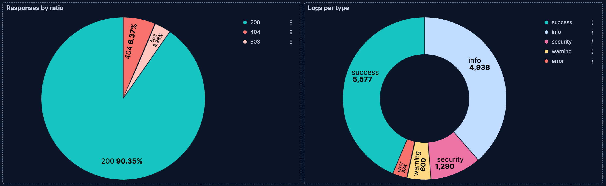

# Build pie charts with {{kib}}

Pie charts display parts of a whole as slices, where each slice represents a value and its size represents its prevalence. Pie charts are ideal for illustrating the relative prevalence of categorical data, and for displaying percentage or proportional data.

You can create pie charts in {{kib}} using [**Lens**](../lens.md).

## When to use pie charts

Pie charts work best when:

* You have a **maximum of 6 slices**. More slices make the chart difficult to read.
* Values are around **25%, 50%, or 75%**. These proportions are easy to perceive accurately.
* One category is **significantly larger** than the others.
* You want to show **part-to-whole relationships** at a glance.

Consider using [bar charts](bar-charts.md) instead when:

* You need to **compare** the exact size of slices.
* You have **more than 6 categories**.
* You need to compare **multiple data sets**. Use part-to-whole bar charts with percentages instead.
* Your data includes **negative values**.

## Build a pie chart

:::{include} ../../_snippets/lens-prerequisites.md
:::

To build a pie chart:

::::::{stepper}

:::::{step} Access Lens
**Lens** is {{kib}}'s main visualization editor. You can access it:
- From a dashboard: On the **Dashboards** page, open or create the dashboard where you want to add a pie chart, then add a new visualization.
- From the **Visualize library** page by creating a new visualization.
:::::

:::::{step} Set the visualization to Pie
New visualizations often start as **Bar** charts.

Using the **Visualization type** dropdown, select **Pie**.
:::::

:::::{step} Define the data to show
1. Select the {{data-source}} that contains your data.
2. Configure the [**Slice by**](#slice-by-settings) dimension to define how the pie is divided into slices. Drag a categorical field to create slices based on its values.
3. Configure the [**Metric**](#metric-settings) dimension to define the size of each slice. This determines the numerical value that each slice represents. {{kib}} automatically selects an appropriate aggregation function compatible with the selected field.

Optionally:
   - Add additional **Slice by** dimensions to create nested slices (a multi-level or sunburst-style chart).
   - Enable [**Multiple metrics**](#multiple-metrics) in the layer settings to compare different measures within the same chart.
:::::

:::::{step} Customize the chart to follow best practices
Tweak the appearance of the chart to your needs. Consider the following best practices:

**Limit the number of slices**
:   Keep your pie chart to a maximum of 6 slices. If you have more categories, consider [grouping smaller values into an "Other" category](#other-category) or using a different visualization type.

**Order slices meaningfully**
:   The largest slice should start at the 12 o'clock position and proceed clockwise in descending order. For categories with a natural order (such as satisfaction ratings), follow that order instead.

**Use color purposefully**
:   Apply colors to highlight important data or patterns. Use the [color mapping feature](../lens.md#assign-colors-to-terms) to assign consistent colors to key categories across your dashboards.

**Consider using a donut**
:   The empty center of donut charts provides space to display additional information, such as a total or key metric. Refer to [Create a donut chart](#donut-chart) for instructions.

**Label clearly**
:   Keep labels inside or close to slices when possible. For charts with many small slices or long labels, use the legend instead.

Refer to [Pie chart settings](#pie-chart-settings) to find all configuration options for your pie chart.
:::::

:::::{step} Save the chart
- If you accessed Lens from a dashboard, select **Save and return** to save the visualization and add it to that dashboard, or select **Save to library** to add the visualization to the Visualize library and reuse it later.
- If you accessed Lens from the Visualize library, select **Save**. A menu opens and lets you add the visualization to a dashboard and to the Visualize library.
:::::

::::::

## Advanced pie chart scenarios

### Create a donut chart [donut-chart]

Donut charts are pie charts with a hollow center. The empty space can provide a visual focal point and space for displaying related information.

1. Create a **Pie** chart visualization.
2. Configure your **Slice by** and **Metric** dimensions.
3. Select {icon}`brush` **Style**.
4. In **Appearance**, set **Donut hole** to **Small**, **Medium**, or **Large** depending on how much center space you want.

### Compare multiple metrics in a pie chart [multiple-metrics]

By default, pie charts use a single metric with **Slice by** to split that metric by values in a categorical field. The **Multiple metrics** option lets you take a different approach: each slice represents a distinct metric you define, rather than values from your data.

This is useful when:

* You want to compare metrics that apply different filters to the same aggregation
* You need to show custom-defined categories that don't exist as values in a field
* You want to compare different calculations or formulas side by side

#### Example: Server resource consumption

Imagine your web logs data includes multiple numeric fields representing different resource types, such as `response_bytes`, `processing_time_ms`, and `memory_used_kb`. You want to visualize how each resource contributes to overall server load.

1. Create a **Pie** chart and remove any existing **Slice by** dimension.
2. Open **Layer settings**:
   * {applies_to}`serverless: ga` {applies_to}`stack: ga 9.3` Select {icon}`app_management` **Layer settings**.
   * {applies_to}`stack: ga 9.0-9.2` Select {icon}`boxes_vertical`, then select **Layer settings**.
3. Select **Multiple metrics**, then close the **Layer settings** menu.
4. Add metrics for each resource type:

   | Slice | Metric configuration |
   |-------|---------------------|
   | Bandwidth | `Sum(response_bytes)` |
   | Processing time | `Sum(processing_time_ms)` |
   | Memory usage | `Sum(memory_used_kb)` |

   For each metric, select the **Metric** dimension and configure the field. Customize the **Name** to display meaningful labels in the legend.

5. Optionally, assign custom colors to each metric by selecting the metric and choosing a **Series color**.

This example demonstrates the core value of multiple metrics: comparing different numeric fields that represent distinct concepts. Unlike **Slice by**, which splits a single metric by category values, multiple metrics lets you place fundamentally different measurements side by side.

:::{note}
The {{kib}} sample data sets don't include multiple comparable numeric fields. To try this scenario, adapt the field names to match your own data.
:::

### Group smaller values into a single slice [other-category]

When you have many categories with small values, you can group them into an "Other" category to simplify the visualization.

1. In the **Slice by** configuration, select the field.
2. Use **Top values** to limit the number of slices displayed.
3. Expand **Advanced**.
4. Enable **Group other values as "Other"** to combine remaining values into a single slice.

:::{tip}
Be careful when using "Other", as it could end up being the largest category, which might obscure the meaning of your chart. Consider whether a bar chart might be more appropriate for data with many categories.
:::

#### Example: Top hosts with remaining grouped as "Other"

This example uses the **Kibana Sample Data Logs** data set. If you haven't installed it yet, refer to [Sample data](/manage-data/ingest/sample-data.md) for instructions.

1. Create a **Pie** chart using the **Kibana Sample Data Logs** {{data-source}}.
2. In the **Slice by** dimension, select `host.keyword` with **Top values** set to **3**.
3. Expand **Advanced** and make sure that the **Group other values as "Other"** option is active.
4. Set the **Metric** to the **Count** function.

The resulting chart shows the 3 most common hosts, with all remaining hosts combined into a single "Other" slice. This keeps the chart readable while still accounting for the full data set.

## Pie chart settings [pie-chart-settings]

Customize your pie chart to display exactly the information you need, formatted the way you want.

### Slice by settings [slice-by-settings]

The **Slice by** dimension defines how your pie is divided into segments. You can add up to 3 levels of slicing to create hierarchical visualizations.

**Data**
:   The **Slice by** dimension supports the following functions:

    - **Top values**: Create slices for the most common values in a field.
      - **Field**: Select the field to group by. You can add up to 4 fields to create multi-term slices. When multiple fields are selected, each slice represents a unique combination of values across those fields. You can reorder the fields by dragging them to change their priority.
      - **Number of values**: How many top values to display.
      :::{include} ../../_snippets/lens-rank-by-options.md
      :::
      - **Collapse by**: Aggregate values into a single number using `Sum`, `Average`, `Min`, or `Max`.
      :::{include} ../../_snippets/lens-breakdown-advanced-settings.md
      :::
    - **Date histogram**: Group data into time-based buckets (useful for showing time-based composition). Configure the time interval and how to handle date formatting.
      - **Field**: Select the date field to use for the time-based grouping.
      :::{include} ../../_snippets/lens-histogram-settings.md
      :::
      - **Collapse by**: Aggregate values into a single number using `Sum`, `Average`, `Min`, or `Max`.
    - **Intervals**: Create numeric ranges for continuous data. Useful for grouping numeric fields into buckets. You can define the interval granularity or specify custom ranges.
      - **Field**: Select the numeric field to create intervals from.
      - **Include empty rows**: Include intervals with no matching documents. On by default.
      - **Collapse by**: Aggregate values into a single number using `Sum`, `Average`, `Min`, or `Max`.
      :::{dropdown} How does interval granularity work?
      Interval granularity divides the field into evenly spaced intervals based on the minimum and maximum values for the field.
      
      The size of the interval is a "nice" value. When the granularity of the slider changes, the interval stays the same when the "nice" interval is the same. The minimum granularity is 1, and the maximum value is histogram:maxBars. To change the maximum granularity, go to Advanced settings.
      
      Intervals are incremented by 10, 5 or 2. For example, an interval can be `100` or `0.2`.
      :::
    - **Filters**: Define custom KQL filters to create specific slices. Each filter creates one slice in the chart.
      - **Collapse by**: Aggregate values into a single number using `Sum`, `Average`, `Min`, or `Max`.

**Appearance**
:   Configure slice-level options:
    - **Name**: Customize the legend label.
    - **Color mapping**: Select a color palette or assign specific colors to categories. Refer to [Assign colors to terms](../lens.md#assign-colors-to-terms) for details.

### Metric settings [metric-settings]

The **Metric** dimension defines the size of each slice.

**Data**
:   The main value that appears prominently in your chart. When you drag a field onto the chart, {{kib}} suggests a function based on the field type. You can change it and use aggregation functions like `Sum`, `Average`, `Count`, `Median`, and more, or create custom calculations with formulas. Refer to  for examples, or to the {icon}`documentation` **Formula reference** available from Lens.

    :::{include} ../../_snippets/lens-value-advanced-settings.md
    :::

**Appearance**
:   - **Name**: Customize the metric label displayed in tooltips and legends.
    - **Value format**: Control how numeric values are displayed (number, percent, bytes, and more).
    - **Series color**: When using multiple metrics without a **Slice by** dimension, use this option to assign a specific color to each metric.

### General layout [appearance-options]

When creating or editing a visualization, you can customize several appearance options from the {icon}`brush` **Style** or  **Legend** menus.

#### Style settings

**Appearance**
:   Control the main visual aspects of the pie chart.

    **Donut hole**
    :   Transform your pie chart into a donut by adding a center hole:
        - **None**: Standard pie chart with no hole (default).
        - **Small**: Small center hole.
        - **Medium**: Medium center hole.
        - **Large**: Large center hole for emphasis or to display additional information.

**Titles and text**
:   Control slice labels and values.

    **Slice labels**
    :   Control how labels appear on the slices:
        - **Hide**: Do not display labels on slices.
        - **Inside**: Display labels inside the slices.
        - **Auto**: Automatically position labels for optimal readability (default).

    **Slice values**
    :   Control what values appear on the slices (when labels are visible):
        - **Hide**: Do not display values.
        - **Integer**: Display the raw numeric value.
        - **Percentage**: Display the percentage of the total.

          When displaying percentages, you can also configure the **Decimal places** (0-10) for precision.

#### Legend settings

Configure elements of your pie chart's legend:

**Visibility**
:   Specify whether to automatically show the legend or hide it:
    - **Auto**: Show the legend when there are multiple slices (default).
    - **Show**: Always show the legend.
    - **Hide**: Never show the legend.

**Nested**
:   When using multiple **Slice by** dimensions, enable this option to show the legend in a hierarchical format that reflects the slice hierarchy.

**Label truncation**
:   Choose whether to truncate long legend labels, and set a limit for how many lines to display.

**Width**
:   Set the width of the legend.

## Pie chart examples

The following examples show various configuration options for building impactful pie charts.

**Website traffic by source**
:   Visualize the distribution of traffic sources to your website:

    * Example based on: Kibana Sample Data Logs
    * Configuration: [**Multiple metrics**](#multiple-metrics)
    * **Metrics**: 4 metrics based on formulas
        * `count(kql='referer : *elastic*')`, named "Elastic website"
        * `count(kql='referer : *twitter*')`, named "Twitter/X"
        * `count(kql='referer : *facebook*')`, named "Facebook"
        * `count(kql='referer : *nytimes*')`, named "NY Times"
    * **Style**: Donut with medium hole
    * **Legend**: Show

**Revenue distribution by product category**
:   Show how revenue is distributed across product categories:

    * Example based on: Kibana Sample Data eCommerce
    * **Slice by**: `category.keyword` (Top values, 6)
    * **Metric**: Sum of `taxful_total_price`
    * **Style**: Pie (no donut hole)

**Error distribution by type**
:   Display the proportion of different error types in your application:

    * Example based on: Kibana Sample Data Logs
    * **Slice by**: `error.type` using **Filters**:
      - "Client Error": `response.keyword >= "400" AND response.keyword < "500"`
      - "Server Error": `response.keyword >= "500"`
      - "Success": `response.keyword >= "200" AND response.keyword < "400"`
    * **Metric**: `Count of records`
    * **Style**: Donut with large hole
    * **Color mapping**: Red for client errors, yellow for server errors, green for success

