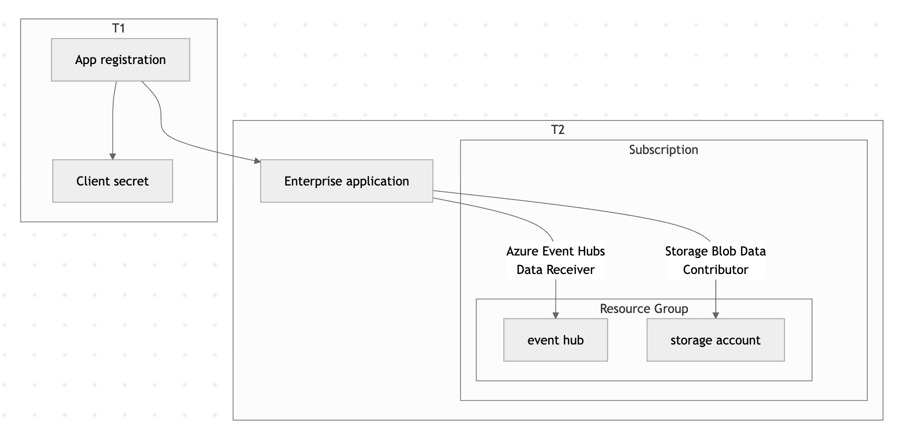

# Ingest multi-tenant Azure Event Hub logs with Filebeat

In this guide, you'll configure {{filebeat}} to ingest logs from Azure Event Hubs in a multi-tenant scenario where authentication credentials are stored in one Microsoft Entra ID tenant (T1) and the Event Hub resources live in a separate tenant (T2).

By the end, you'll have a working pipeline that collects logs from an Event Hub in T2 using credentials stored in T1, and forwards them to {{es}}.



## Before you begin

Make sure you have the following:

- **Two Azure tenants**: A credential tenant (T1) and a resource tenant (T2).
- **Azure CLI**: [Installed and configured](https://learn.microsoft.com/en-us/cli/azure/install-azure-cli).
- **{{filebeat}}**: [Installed](https://www.elastic.co/docs/reference/beats/filebeat/setting-up-running) on the host where you'll run the data collection.
- **An Elastic deployment**: Either an [Elastic Cloud](https://cloud.elastic.co) deployment or a self-managed {{es}} cluster to send data to.
- **Sufficient Azure permissions**: The ability to create app registrations in T1, and to create service principals and assign roles in T2.

## Set up multi-tenant log ingestion

:::::{stepper}
::::{step} Create a multi-tenant app registration in T1

Log in to the credential tenant (T1) and create a multi-tenant application:

```shell
az login --tenant aaaaaaaa-1111-1111-1111-111111111111
```

```shell
az ad app create \
  --display-name "My Multi-Tenant App" \
  --sign-in-audience AzureADMultipleOrgs
```

Then reset the application password to generate a client secret:

```shell
az ad app credential reset \
  --id cccccccc-3333-3333-3333-333333333333 \
  --append \
  --display-name "Production Secret" \
  --years 1
```

Save the `password` value from the output — you'll need it for the {{filebeat}} configuration.

```json
{
  "appId": "cccccccc-3333-3333-3333-333333333333",
  "password": "<redacted>",
  "tenant": "aaaaaaaa-1111-1111-1111-111111111111"
}
```
::::

::::{step} Provision the enterprise app in T2

Log in to the resource tenant (T2) and create a service principal for the app you registered in T1:

```shell
az login --tenant bbbbbbbb-2222-2222-2222-222222222222
```

```shell
az ad sp create --id cccccccc-3333-3333-3333-333333333333
```

:::{image} /solutions/images/observability-azure-beats-multi-tenant-app-registration.png
:alt: Azure Portal showing multi-tenant app registration
:::

::::

::::{step} Create an Event Hubs namespace and hub in T2

Set environment variables for the resources you'll create:

```shell
export RESOURCE_GROUP="contoso-multi-tenant-demo"
export AZURE_LOCATION="eastus2"
export AZURE_EVENTHUB_NAMESPACE="contoso-multi-tenant-demo"
export AZURE_STORAGE_ACCOUNT_NAME="contosomultitenantdemo"
```

Create a resource group:

```shell
az group create --name $RESOURCE_GROUP --location $AZURE_LOCATION
```

Create the Event Hubs namespace:

```shell
az eventhubs namespace create \
  --name $AZURE_EVENTHUB_NAMESPACE \
  --resource-group $RESOURCE_GROUP \
  --location $AZURE_LOCATION \
  --sku Basic \
  --capacity 1
```

Create the event hub:

```shell
az eventhubs eventhub create \
  --name logs \
  --namespace-name $AZURE_EVENTHUB_NAMESPACE \
  --resource-group $RESOURCE_GROUP \
  --partition-count 2 \
  --retention-time-in-hours 1 \
  --cleanup-policy Delete
```
::::

::::{step} Create a storage account in T2

Create a storage account for {{filebeat}} to use for checkpointing:

```shell
az storage account create \
  --name $AZURE_STORAGE_ACCOUNT_NAME \
  --resource-group $RESOURCE_GROUP \
  --location $AZURE_LOCATION \
  --sku Standard_LRS \
  --kind StorageV2
```
::::

::::{step} Assign roles to the application

Grant the multi-tenant application permission to receive messages from the Event Hub and read/write blobs in the storage account:

```shell
az role assignment create \
  --role "Azure Event Hubs Data Receiver" \
  --assignee cccccccc-3333-3333-3333-333333333333 \
  --scope /subscriptions/eeeeeeee-5555-5555-5555-555555555555/resourceGroups/contoso-multi-tenant-demo/providers/Microsoft.EventHub/namespaces/contoso-multi-tenant-demo
```

```shell
az role assignment create \
  --role "Storage Blob Data Contributor" \
  --assignee cccccccc-3333-3333-3333-333333333333 \
  --scope /subscriptions/eeeeeeee-5555-5555-5555-555555555555/resourceGroups/contoso-multi-tenant-demo/providers/Microsoft.Storage/storageAccounts/contosomultitenantdemo
```
::::

::::{step} Configure and run Filebeat

Create a {{filebeat}} configuration file that uses the T1 credentials to access T2 resources. For a full list of available options, refer to the [Azure Event Hub input reference](https://www.elastic.co/docs/reference/beats/filebeat/filebeat-input-azure-eventhub).

```yaml callouts=false
filebeat.inputs:
- type: azure-eventhub
  enabled: true

  # Available starting from Filebeat 8.19.10, 9.1.10, 9.2.4, or later.
  auth_type: client_secret

  tenant_id: bbbbbbbb-2222-2222-2222-222222222222          # T2
  client_id: cccccccc-3333-3333-3333-333333333333          # T1
  client_secret: ${AZURE_CLIENT_SECRET}                    # T1

  eventhub: logs
  eventhub_namespace: contoso-multi-tenant-demo.servicebus.windows.net  # T2
  consumer_group: $Default

  storage_account: contosomultitenantdemo # T2

  processor_version: v2
  migrate_checkpoint: true
  processor_update_interval: 10s
  processor_start_position: earliest
  partition_receive_timeout: 5s
  partition_receive_count: 100
```

Run {{filebeat}}:

```shell
filebeat -e -v -d "*" \
  --strict.perms=false \
  --path.home . \
  -E cloud.id=<redacted> \
  -E cloud.auth=<redacted> \
  -E gc_percent=100 \
  -E setup.ilm.enabled=false \
  -E setup.template.enabled=false \
  -E output.elasticsearch.allow_older_versions=true
```
::::

::::{step} Verify the setup

To confirm the pipeline is working end to end:

1. Send a test message to the event hub in T2. Refer to the [Microsoft Send Event API](https://learn.microsoft.com/en-us/rest/api/eventhub/send-event) for details.
2. Check that {{filebeat}} receives the message and forwards it to {{es}}.
3. In {{kib}}, navigate to **Discover** and verify the event appears in your index.

::::
:::::

## Next steps

- Configure [additional {{filebeat}} settings](https://www.elastic.co/docs/reference/beats/filebeat/configuring-howto-filebeat) to parse and enrich your Azure logs.
- Set up [dashboards in {{kib}}](https://www.elastic.co/docs/solutions/observability) to visualize your ingested data.
- Explore the [Azure Event Hub integration](https://www.elastic.co/docs/reference/integrations/azure/eventhub) for an {{agent}}-based alternative.

## Related pages

- [Azure Event Hub input reference](https://www.elastic.co/docs/reference/beats/filebeat/filebeat-input-azure-eventhub)
- [Monitor Microsoft Azure with {{beats}}](monitor-microsoft-azure-with-beats.md)
- [Monitor Microsoft Azure with {{agent}}](monitor-microsoft-azure-with-elastic-agent.md)
- [Azure Logs integration](https://www.elastic.co/docs/reference/integrations/azure)
- [Set up and run {{filebeat}}](https://www.elastic.co/docs/reference/beats/filebeat/setting-up-running)
- [{{filebeat}} command reference](https://www.elastic.co/docs/reference/beats/filebeat/command-line-options)
