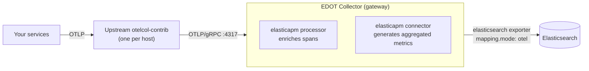

# Send data from an upstream OpenTelemetry Collector [upstream-collector-self-managed]

This guide shows how to forward telemetry data from an existing (upstream) OpenTelemetry Collector to a self-managed {{stack}} using an [{{edot}} (EDOT) Collector](elastic-agent://reference/edot-collector/index.md) configured as a gateway. The examples use the [contrib distribution](https://github.com/open-telemetry/opentelemetry-collector-releases/tree/main/distributions/otelcol-contrib) (`otelcol-contrib`), but the same approach works with any OTel Collector distribution, including vendor distributions and custom builds assembled with the [OpenTelemetry Collector Builder](https://opentelemetry.io/docs/collector/custom-collector/).

## When to use this setup

Use this setup if you:

* Already run an existing OpenTelemetry Collector and want to add Elastic as a backend without replacing your current setup
* Need to send telemetry to multiple observability backends from a single Collector
* Evaluate Elastic alongside another backend before committing to a full migration
* Use a technology or language for which Elastic doesn't provide an EDOT SDK

## Architecture

Your services send telemetry to an OpenTelemetry Collector (for example, `otelcol-contrib`), which forwards it over OTLP/gRPC to the EDOT Collector gateway. The gateway applies Elastic-specific processing and writes directly to {{es}}.



The `elasticsearch` exporter with `mapping.mode: otel` is the recommended path for self-managed deployments.

:::{note}
The [Managed OTLP endpoint](opentelemetry://reference/motlp.md) is an alternative ingest path available only on {{ecloud}}, so it doesn't apply to self-managed deployments. Sending directly to {{apm-server-or-mis}} through OTLP is also possible, but the EDOT gateway path in this guide is recommended for full {{product.apm}} functionality.
:::

## Before you begin

You’ll need:

* A running [self-managed](/deploy-manage/deploy/self-managed.md) {{es}} cluster
* The EDOT Collector installed on the gateway host. It ships as part of the {{agent}} package and runs as {{agent}} in `otel` mode.
* An existing OpenTelemetry Collector installed on your agent hosts. This guide uses [`otelcol-contrib`](https://opentelemetry.io/docs/collector/installation/).
* Network connectivity from your Collector hosts to the EDOT gateway host on port 4317

## Set up the EDOT gateway

:::::{stepper}

::::{step} Create an {{es}} API key

The EDOT gateway authenticates to {{es}} using an API key.

1. Find **API keys** in the navigation menu or use the [global search field](/explore-analyze/find-and-organize/find-apps-and-objects.md).
2. Select **Create API key**.
3. Give the key a name (for example, `edot-gateway`) and assign it `auto_configure` and `create_doc` index privileges on the `logs-*.otel-*`, `metrics-*.otel-*`, and `traces-*.otel-*` indices.
4. Copy the encoded key to use as the value of the `ELASTIC_API_KEY` environment variable in the gateway configuration.

::::

::::{step} Configure the EDOT gateway

1. Set the following environment variables on the gateway host before starting the Collector:

    ```bash
    export ELASTIC_ENDPOINT=https://your-elasticsearch:9200
    export ELASTIC_API_KEY=your-encoded-api-key
    ```

2. Create the following configuration file and save it as `gateway.yml` on the gateway host:

    ```yaml
    receivers:
      otlp:
        protocols:
          grpc:
            endpoint: 0.0.0.0:4317
          http:
            endpoint: 0.0.0.0:4318

    connectors:
      elasticapm: {}

    processors:
      elasticapm: {}

    exporters:
      elasticsearch/otel:
        endpoints:
          - ${env:ELASTIC_ENDPOINT}
        api_key: ${env:ELASTIC_API_KEY}
        mapping:
          mode: otel

    service:
      pipelines:
        traces:
          receivers: [otlp]
          processors: [elasticapm]
          exporters: [elasticapm, elasticsearch/otel]
        metrics:
          receivers: [otlp]
          processors: []
          exporters: [elasticsearch/otel]
        metrics/aggregated-otel-metrics:
          receivers: [elasticapm]
          processors: []
          exporters: [elasticsearch/otel]
        logs:
          receivers: [otlp]
          processors: []
          exporters: [elasticsearch/otel]
    ```

    Key components in this configuration:

    * **`elasticapm` processor** (under `processors`): Enriches spans with attributes required by the {{product.apm}} UI.
    * **`elasticapm` connector** (under `connectors`): Generates pre-aggregated {{product.apm}} metrics from trace data. It appears as an exporter in the `traces` pipeline and as a receiver in the `metrics/aggregated-otel-metrics` pipeline.
    * **`elasticsearch/otel` exporter**: Writes data directly to {{es}} using native OpenTelemetry data streams (`mapping.mode: otel`). The exporter handles batching automatically using `sending_queue`. Refer to [Performance and batching](elastic-agent://reference/edot-collector/components/elasticsearchexporter.md#performance-and-batching) to customize throughput for your environment.

    :::{note}
    The `elasticapm` connector and processor are required for full {{product.apm}} functionality (service maps, transaction histograms, service-level indicators). You only need them when exporting directly to {{es}}. If you send data to the Managed OTLP endpoint or {{apm-server-or-mis}}, they are not required.

    Refer to [{{product.apm}} services missing due to misconfigured elasticapm connector](/troubleshoot/ingest/opentelemetry/edot-collector/misconfigured-elasticapm-connector.md) for more information.
    :::

3. Start the EDOT gateway. The EDOT Collector is the {{agent}} binary run in `otel` mode, so start it with the `otel` subcommand:

    ```bash
    elastic-agent otel --config gateway.yml
    ```

::::

::::{step} Configure the contrib Collector

1. Configure the OTLP exporter to point to the EDOT gateway. On each contrib Collector host, add or update the `exporters` and `service` sections in your existing `config.yml`:

    ```yaml
    exporters:
      otlp:
        endpoint: "gateway-host:4317"
        tls:
          insecure: true  # Set to `false` and configure `ca_file` for production

    service:
      pipelines:
        traces:
          exporters: [otlp]
        metrics:
          exporters: [otlp]
        logs:
          exporters: [otlp]
    ```

    Replace `gateway-host` with the hostname or IP of your EDOT gateway host. In production, set `insecure: false` and configure `ca_file` with the path to the CA certificate used to secure communication between the contrib Collector and the gateway. Refer to the [TLS configuration settings](https://github.com/open-telemetry/opentelemetry-collector/blob/main/config/configtls/README.md) for the full list of options.

2. Set the `deployment.environment` resource attribute in your contrib Collector so that services appear under the correct environment in the {{kib}} {{product.apm}} Service Map. Without it, all services show as "unset" in the environment selector:

    ```yaml
    processors:
      resource:
        attributes:
          - key: deployment.environment
            action: insert
            value: production
    ```

    Refer to [Attributes and labels](/solutions/observability/apm/opentelemetry/attributes.md) for more details.

3. Restart the contrib Collector to apply the changes.

::::

::::{step} Verify data in {{kib}}

After starting both Collectors, wait a few minutes for data to appear. Then verify in {{kib}}:

* Find **Applications** in the navigation menu or use the [global search field](/explore-analyze/find-and-organize/find-apps-and-objects.md), then go to **Services** to confirm your services appear.
* From **Applications**, go to **Service Map** to confirm environment-based filtering works.
* Find **Discover** in the navigation menu or use the [global search field](/explore-analyze/find-and-organize/find-apps-and-objects.md) and check the `traces-generic.otel-default`, `logs-generic.otel-default`, and `metrics-generic.otel-default` data streams for incoming data.

If no data appears, refer to [No logs, metrics, or traces visible in {{kib}}](/troubleshoot/ingest/opentelemetry/no-data-in-kibana.md) for troubleshooting tips.

::::

:::::

## Related pages

* [No logs, metrics, or traces visible in {{kib}}](/troubleshoot/ingest/opentelemetry/no-data-in-kibana.md)
* [{{product.apm}} services missing due to misconfigured elasticapm connector](/troubleshoot/ingest/opentelemetry/edot-collector/misconfigured-elasticapm-connector.md)
* [Attributes and labels](/solutions/observability/apm/opentelemetry/attributes.md)
* [EDOT Collector](elastic-agent://reference/edot-collector/index.md)
* [Managed OTLP endpoint](opentelemetry://reference/motlp.md)
