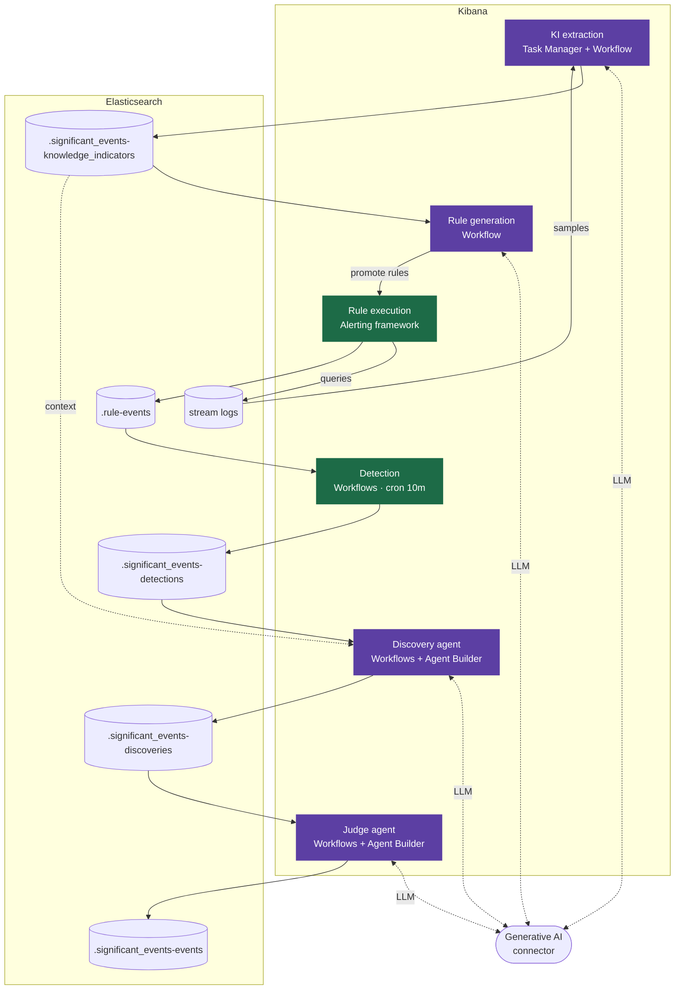

# How Significant Events works [sig-events-how-it-works]

This page describes the pipeline behavior for engineers and adopters who need to understand how Significant Events processes data, what runs where, and how to trace results across the system.

The pipeline has four sequential phases, each building on the outputs of the previous:

- [Phase 1: KI extraction](#sig-events-hiw-ki): LLM and programmatic analysis of stream logs
- [Phase 2: Rule generation](#sig-events-hiw-rules): LLM generates detection rules using KIs as input
- [Phase 3: Rule execution](#sig-events-hiw-execution): Alerting framework runs promoted rules continuously
- [Phase 4: Discovery](#sig-events-hiw-discovery): Detection, discovery, and triage workflows convert alert signals into confirmed Significant Events



## Phase 1: KI extraction [sig-events-hiw-ki]

Knowledge Indicators (KIs) are stable, evidence-backed facts about the services and infrastructure present in a stream's log data. The LLM that generates detection operates entirely on KIs. This keeps rule generation deterministic and decouples detection logic from data format specifics.

### How KIs are extracted

The pipeline runs up to five iterations, sampling up to 20 documents per round from entity-filtered, diverse, and random buckets. KIs found in one iteration are excluded from the next, steering each round toward undiscovered patterns. LLM analysis and deterministic code generators run in parallel; deterministic KIs always score 100 confidence. See [KI extraction](./knowledge-indicators.md#sig-events-ki-extraction) for the full extraction flow.

### KI types

KIs cover five types: Entity, Infrastructure, Technology, Dependency, and Schema. Entity KIs have the highest extraction priority — services and databases are identified before individual pods or hosts. See [KI types](./knowledge-indicators.md#sig-events-ki-types) for the full data model.

### KI lifecycle

KIs are written to `.significant_events-knowledge_indicators`, deduplicated on `(type, subtype, properties)`, and expire after 30 days if not re-observed. See [KI lifecycles](./knowledge-indicators.md#sig-events-ki-lifecycle) for lifecycle and continuous extraction details.

## Phase 2: Rule generation [sig-events-hiw-rules]

Once KIs exist for a stream, the LLM generates detection rules using them as input. Rules are expressed as native {{esql}} expressions targeting the stream's index pattern:

```
FROM {stream},{stream}.* METADATA _id | WHERE <esql_expression>
```

The LLM operates in a reasoning loop: it calls `get_stream_features` to retrieve KIs for the stream, analyzes what entities and technologies are present, then calls `add_queries` to submit a batch of rules. This means rules are scoped to the specific services and failure modes present in each stream.

## Phase 3: Rule execution [sig-events-hiw-execution]

Each promoted rule runs as a {{kib}} alerting rule on a per-rule schedule. On each execution cycle, the rule:

1. Builds an {{esql}} query from the stored rule parameters.
2. Queries the stream with a lookback window of 2× the rule interval to ensure no events fall through the gap between runs.
3. Excludes document IDs seen in previous executions.
4. Writes matching rows to `.rule-events`.

**Execution cap**: Each rule execution writes at most 1,000 alert documents. Matching events beyond this limit are dropped.

## Phase 4: Discovery [sig-events-hiw-discovery]

Discovery converts raw alert signals into confirmed Significant Events. It runs as three sequenced workflows (detection, discovery, and triage) coordinated by an Orchestrator workflow.

- [Detection Workflow](#sig-events-hiw-detection) — `change_point` analysis per alerting rule, written to the detections index
- [Discovery Workflow](#sig-events-hiw-discovery-agent) — discovery agent generates hypotheses, written to the discoveries index
- [Triage Workflow](#sig-events-hiw-triage) — judge agent independently verifies and promotes, written to the events index

### Detection [sig-events-hiw-detection]

The Detection Workflow reads `.rule-events` and runs `change_point` analysis grouped per alerting rule. When a rule's alert pattern enters a genuinely anomalous state, the workflow appends a detection document to the detections index. Current state per rule is the latest document.

Change point detection is per-rule: a stream can have many independent rules, and one rule recovering does not collapse the signal from others still anomalous on the same stream.

### Discovery agent [sig-events-hiw-discovery-agent]

The discovery workflow reads unhandled detection documents and calls the discovery agent. The discovery agent is a hypothesis agent. It reads detection signals and produces structured discovery documents describing what is happening. Its scope is observation only, describing the anomaly, not prescribing remediation.

### Triage and the judge agent [sig-events-hiw-triage]

The triage workflow reads unassessed discovery documents and calls the judge agent. The judge agent independently verifies the discovery agent's hypothesis and promotes, acknowledges, demotes, or resolves it. The judge agent runs in a separate invocation with no shared state. It receives the discovery agent's output as input but is explicitly instructed to treat it as a hypothesis to challenge, not a conclusion to ratify. Status transitions are written as new documents to the events index.

The two-agent design is intended to prevent a single agent that both investigates and judges from confirming its own hypothesis.

## {{esql}} traceability [sig-events-hiw-traceability]

{{esql}} is the exclusive query language across the pipeline. Every rule is expressed as {{esql}}. Every artifact is stored as an {{es}} document. This means any point in the pipeline is queryable without leaving {{esql}}.

| What to query | {{esql}} target |
|---|---|
| Knowledge Indicators | `FROM .significant_events-knowledge_indicators` |
| Alert documents (rule execution results) | `FROM .rule-events` |
| Detection state per rule | `FROM .significant_events-detections` |
| Significant Events | `FROM .significant_events-events` |

**Traceability**: To trace a Significant Event back to its origin, use `event_id` as the durable key linking events to detections. From the events index, use `signals[].metadata.detection_id` to reach the detection document in `.significant_events-detections`, and `signals[].metadata.rule_uuid` to reach the alerting rule in `.rule-events`.

## Learn more [sig-events-hiw-learn-more]

- [Significant Events overview](./index.md): Get an overview and prerequisites for Significant Events
- [Operator guide](./operator-guide.md): Learn more about system impact, cost drivers, and operational procedures
- [Knowledge Indicators](./knowledge-indicators.md): Get an in-depth overview of how KIs work
